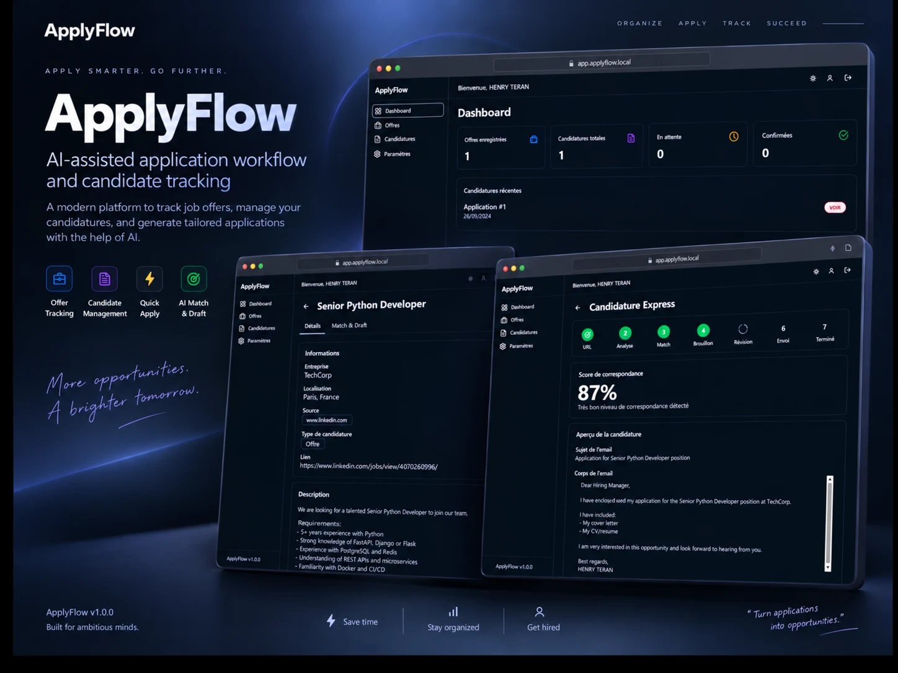
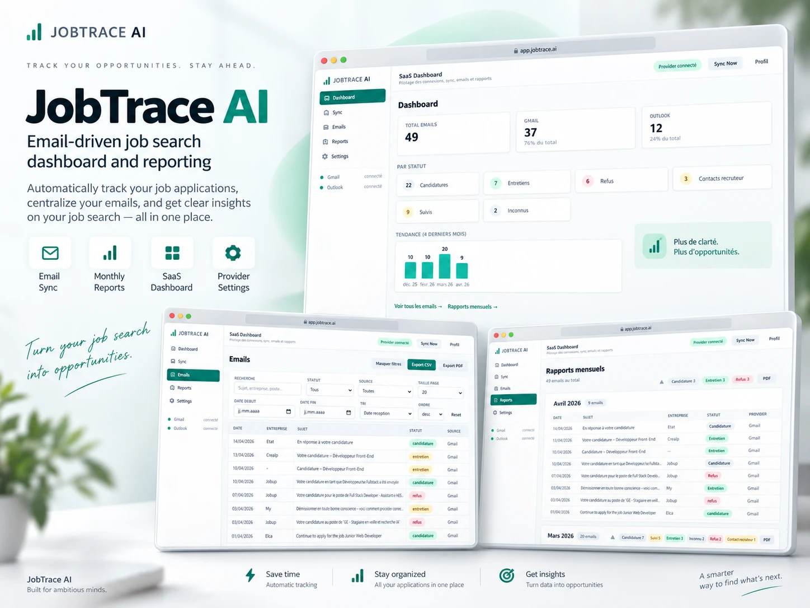
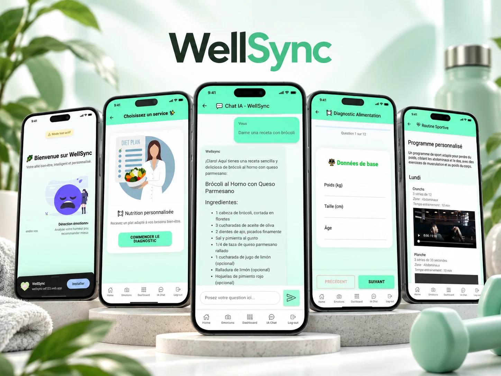

<div align="center">

# Henry Teran

### Full-Stack Developer & Applied AI Engineer

**Des processus métier complexes, des logiciels clairs et intelligents.**

Genève, Suisse · Produits métier & SaaS · IA appliquée

[**Découvrir le portfolio →**](https://henryteran.com/fr) · [LinkedIn](https://linkedin.com/in/henry-teran) · [Me contacter](mailto:teranhenryc@gmail.com)

[](package.json)
[](package.json)
[](package.json)
[](package.json)
[](LICENSE)

[Français](https://henryteran.com/fr) · [English](https://henryteran.com/en) · [Español](https://henryteran.com/es)

</div>

---

## Relier le besoin métier à un produit utilisable

Je conçois des applications qui relient les processus, les données et l’expérience utilisateur : ERP modulaires, outils de candidature, automatisation et applications mobiles. Mon travail couvre l’architecture, le backend et l’interface, avec une IA intégrée aux usages et encadrée par des permissions et une validation humaine.

Ce portfolio présente **quatre études de cas** avec contexte métier, rôle, architecture, défis techniques et aperçus produit. Ce dépôt contient le code du portfolio et de ses API de contact ; les applications présentées sont décrites dans les études de cas.

**Ouvert aux opportunités en développement full-stack, logiciels métier et IA appliquée.** Pour échanger sur un poste, une mission ou un produit : [LinkedIn](https://linkedin.com/in/henry-teran) ou [email](mailto:teranhenryc@gmail.com).

## Projets sélectionnés

<table>
  <tr>
    <td width="50%" align="center">
      <a href="https://henryteran.com/fr/projects/zigoma"></a><br />
      <strong>ZIGOMA</strong> · ERP métier modulaire
    </td>
    <td width="50%" align="center">
      <a href="https://henryteran.com/fr/projects/applyflow"></a><br />
      <strong>ApplyFlow</strong> · Candidatures assistées par IA
    </td>
  </tr>
  <tr>
    <td width="50%" align="center">
      <a href="https://henryteran.com/fr/projects/jobtrace-ai"></a><br />
      <strong>JobTrace AI</strong> · Suivi depuis les emails · En développement
    </td>
    <td width="50%" align="center">
      <a href="https://henryteran.com/fr/projects/wellsync"></a><br />
      <strong>WellSync</strong> · Application mobile de bien-être
    </td>
  </tr>
</table>

| Projet et rôle | Enjeu métier et sujets techniques | Technologies du projet |
| --- | --- | --- |
| [**ZIGOMA**](https://henryteran.com/fr/projects/zigoma) — Lead Developer, architecture & full-stack | Relier CRM, ventes, facturation, stocks et finance. Isolation multi-entreprise, RBAC, idempotence et assistant IA contextualisé. | Python, Flask, Firestore, OpenAI, Pandas, NumPy, Tailwind, WeasyPrint |
| [**ApplyFlow**](https://henryteran.com/fr/projects/applyflow) — Full-stack & IA appliquée | Centraliser les offres et les candidatures. Matching IA, génération de lettres, traitements en arrière-plan et isolation utilisateur. | React, TypeScript, FastAPI, PostgreSQL, Redis, Docker, OpenAI |
| [**JobTrace AI**](https://henryteran.com/fr/projects/jobtrace-ai) — Backend & IA appliquée | Structurer le suivi à partir des emails Gmail et Outlook. OAuth, synchronisation, extraction, déduplication et rapports PDF. **En développement.** | Python, FastAPI, Gmail API, Microsoft Graph |
| [**WellSync**](https://henryteran.com/fr/projects/wellsync) — Full-stack & produit mobile | Réunir suivi du bien-être et assistance contextualisée. Rôles, données en temps réel et notifications. | Angular, Ionic, Firebase, OpenAI, TypeScript |

## Ce que vous pouvez examiner dans ce dépôt

| Dimension | Mise en œuvre | Point d’entrée dans le code |
| --- | --- | --- |
| **Architecture** | Fonctionnalités, contenu éditorial, données typées et services serveur séparés. | [Fonctionnalités](src/features/), [modèles](src/types/portfolio.ts), [serveur](src/server/) |
| **Expérience produit** | Galeries, vues produit, études de cas, thèmes clair/sombre et animations adaptées à la réduction des mouvements. | [Projets](src/features/projects/), [études de cas](src/features/case-study/), [mouvement](src/features/motion/) |
| **Internationalisation** | Français, anglais et espagnol, routes localisées et ressources de traduction. | [Routage](src/router/AppRouter.tsx), [i18n](src/i18n/index.ts), [contenus](src/content/) |
| **Contact et sécurité** | Validation serveur, Turnstile, quotas Redis, déduplication et confirmation de l’adresse avant notification. | [API](api/), [sécurité](src/server/security/), [envoi SMTP](src/server/mail/) |
| **Confidentialité** | Gestion du consentement pour les analytics et page de confidentialité localisée. | [Consentement](src/privacy/consent.ts), [analytics](src/analytics/), [politique](src/privacy/policy.ts) |
| **SEO** | Métadonnées localisées, URL canoniques, `hreflang`, données structurées et génération du sitemap. | [SEO](src/seo/), [générateur du sitemap](scripts/generate-sitemap.mjs) |
| **Vérification** | Tests des formulaires, de la navigation, du consentement, des emails et des protections contre les abus. | [Tests des formulaires](src/forms/), [tests de sécurité](src/server/security/), [tests de navigation](src/router/) |

La configuration inclut des en-têtes de sécurité et une **CSP en mode Report-Only** : elle collecte les violations sans bloquer les ressources. Le [guide de déploiement CSP](docs/security/csp-rollout.md) détaille son évolution.

## Stack du portfolio

| Couche | Technologies |
| --- | --- |
| Interface | React 18, TypeScript 5, React Router 6 |
| Design et interactions | Tailwind CSS 3, Framer Motion, Lucide React |
| Langues et métadonnées | i18next, react-i18next, React Helmet Async |
| API et emails | Vercel Functions, Nodemailer, SMTP |
| Protection des formulaires | Cloudflare Turnstile, Upstash Redis |
| Qualité et build | Vitest, Testing Library, ESLint 9, Vite 5 |
| Hébergement | Vercel, configuration dans [vercel.json](vercel.json) |

## Lancer le projet

Utiliser **Node.js 22** et npm. Les dépendances sont verrouillées dans `package-lock.json`.

```bash
git clone https://github.com/henryTeran/portofolio.git
cd portofolio
npm ci
npm run dev
```

Le serveur Vite sert l’interface, généralement sur `http://localhost:5173`. Les routes `/fr`, `/en` et `/es` permettent de parcourir les versions localisées.

Pour tester les envois de formulaires, copier `.env.example` vers `.env.local`, configurer les services ci-dessous et utiliser **Vercel Dev** (`npx vercel dev`) pour exécuter également les fonctions `/api/*`. `npm run dev` seul ne fournit pas ces API.

### Commandes utiles

| Commande | Usage |
| --- | --- |
| `npm run dev` | Démarrer l’interface avec rechargement à chaud |
| `npm run type-check` | Vérifier les types de l’application, des API et de la configuration Node |
| `npm run lint` | Exécuter ESLint |
| `npm run test -- --run` | Exécuter les tests Vitest une fois |
| `npm test` | Lancer Vitest en mode interactif |
| `npm run build` | Générer le site dans `dist/` |
| `npm run preview` | Prévisualiser le build frontend |
| `npm run generate:sitemap` | Régénérer le sitemap multilingue |
| `npm run generate:csp-hash` | Générer le hash CSP du JSON-LD |
| `npm run vercel:check` | Générer le sitemap puis construire le site |

### Configuration des formulaires

Les variables attendues sont documentées dans [`.env.example`](.env.example). Les API refusent les soumissions si les services de sécurité requis ne sont pas configurés.

| Groupe | Variables |
| --- | --- |
| SMTP | `SMTP_HOST`, `SMTP_PORT`, `SMTP_SECURE`, `SMTP_USER`, `SMTP_PASSWORD` |
| Expéditeur et destinataire | `MAIL_FROM`, `MAIL_TO`, `MAIL_ACKNOWLEDGEMENT` |
| Anti-bot | `VITE_TURNSTILE_SITE_KEY`, `TURNSTILE_SECRET_KEY` |
| Stockage des protections | `UPSTASH_REDIS_REST_URL`, `UPSTASH_REDIS_REST_TOKEN` |
| Origine et empreintes | `CONTACT_PUBLIC_URL`, `CONTACT_SECURITY_HASH_SECRET` |
| URL du site et sitemap | `VITE_SITE_URL`, `SITE_URL` |

Les identifiants SMTP, Redis et les secrets restent côté serveur, sans préfixe `VITE_`. La clé publique Turnstile est destinée au navigateur. `CONTACT_SECURITY_HASH_SECRET` doit contenir au moins 32 caractères aléatoires ; `CONTACT_PUBLIC_URL` définit l’origine de confiance utilisée dans les emails de vérification. L’accusé de réception complémentaire est optionnel via `MAIL_ACKNOWLEDGEMENT=true`.

<details>
<summary><strong>Parcours de vérification, quotas et développement local</strong></summary>

Le formulaire suit ce parcours :

```text
Formulaire → validation + Turnstile + quotas → email de confirmation
          → clic explicite de vérification → notification SMTP à Henry
```

- Turnstile vérifie le hostname et l’action (`contact` ou `brief`). Utiliser des clés autorisées pour le domaine de chaque environnement.
- Redis applique des limites glissantes atomiques : 5 contacts par 15 minutes et par IP ; 3 briefs par 30 minutes et par IP. Les réseaux partagés peuvent partager un quota ; les attaques distribuées nécessitent une protection supplémentaire au niveau de la plateforme.
- Les empreintes utilisent un HMAC et les adresses IP proviennent des en-têtes de confiance Vercel. Les réservations anti-doublon durent 15 minutes ; les emails de confirmation sont limités à 3 par heure et par destinataire.
- Les contenus en attente expirent après 20 minutes. Les marqueurs de jetons utilisés ou échoués ne contiennent pas le formulaire et expirent après 24 heures. Prévoir une base Redis dédiée sans éviction des clés de sécurité actives.
- Le contrôle MX vérifie le domaine, pas l’existence de la boîte email. Une erreur DNS temporaire laisse le parcours de confirmation se poursuivre.
- Le jeton aléatoire est transmis dans le fragment du lien ; seul son hash SHA-256 est stocké. La page de vérification retire le fragment et est exclue des analytics.
- Un `GET` ne déclenche aucun envoi. Le clic explicite appelle `POST /api/verify-contact`, qui consomme le contenu atomiquement. L’adresse vérifiée devient le `Reply-To` de la notification.
- Le contenu est supprimé avant l’envoi SMTP final. Redis et SMTP ne partagent pas de transaction : un échec de livraison ambigu n’est pas retenté automatiquement et peut nécessiter une nouvelle demande.

Pour un test local explicite, activer **les deux** variables `CONTACT_SECURITY_DEV_MODE=true` et `VITE_CONTACT_SECURITY_DEV_MODE=true`, avec `NODE_ENV=development` et `CONTACT_PUBLIC_URL=http://localhost:5173`. Vercel Dev doit signaler `VERCEL_ENV=development`.

Ce mode utilise un stockage en mémoire et un jeton de contournement signalé dans l’interface. Il est refusé en preview et en production et ne vérifie pas la persistance entre processus. Pour une intégration réaliste, utiliser Redis et les clés de test officielles Cloudflare. La configuration et la livraison réelle des emails doivent être vérifiées dans l’environnement cible.

</details>

## Organisation du code

```text
api/                 Fonctions contact, project-brief, verify-contact et csp-report
src/
  components/        Sections et composants partagés
  features/          Projets, études de cas, expertise et animations
  content/           Textes éditoriaux et études de cas multilingues
  data/              Projets, parcours et expertise
  locales/           Traductions FR / EN / ES
  router/            Routes localisées et gestion du défilement
  forms/             Validation et retours utilisateur
  security/          Widget Turnstile et parcours de vérification
  server/            Logique SMTP et protections côté serveur
  privacy/           Consentement et confidentialité
  analytics/         Suivi conditionné au consentement
  seo/               Métadonnées et référencement
  styles/            Identité visuelle et thèmes
public/              Visuels produit, portrait et ressources statiques
scripts/             Génération du sitemap et du hash CSP
docs/security/       Documentation CSP
```

## Déploiement

Le projet est configuré pour **Vercel** : preset Vite, commande `npm run build`, répertoire de sortie `dist`. Configurer les variables serveur et publiques dans chaque environnement, puis vérifier le parcours de contact complet.

Le fichier [vercel.json](vercel.json) définit les réécritures SPA, les en-têtes et la redirection de `www.henryteran.com` vers `henryteran.com`. Pour l’historique de migration et les vérifications de domaine, consulter [VERCEL-MIGRATION.md](VERCEL-MIGRATION.md) ; pour les variables attendues, se référer à [`.env.example`](.env.example).

---

<div align="center">

**Un besoin métier à transformer en logiciel ? Parlons-en.**

[Portfolio](https://henryteran.com/fr) · [LinkedIn](https://linkedin.com/in/henry-teran) · [Email](mailto:teranhenryc@gmail.com) · [GitHub](https://github.com/henryTeran)

Code distribué sous [licence MIT](LICENSE) · Henry Teran

</div>
